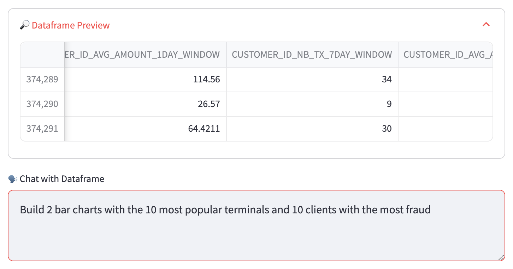
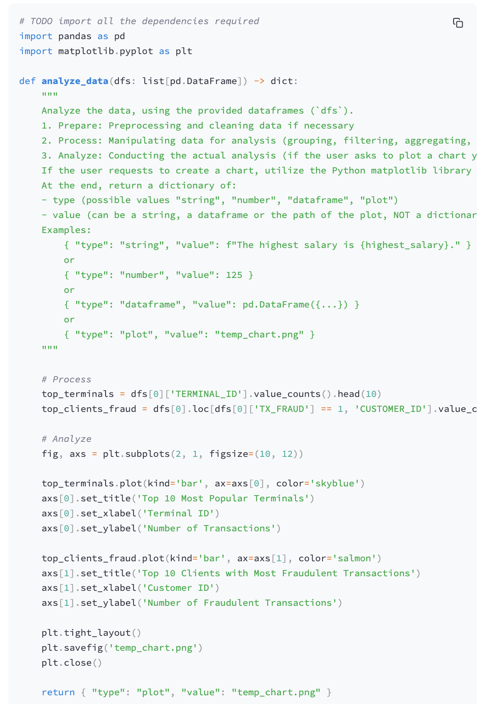
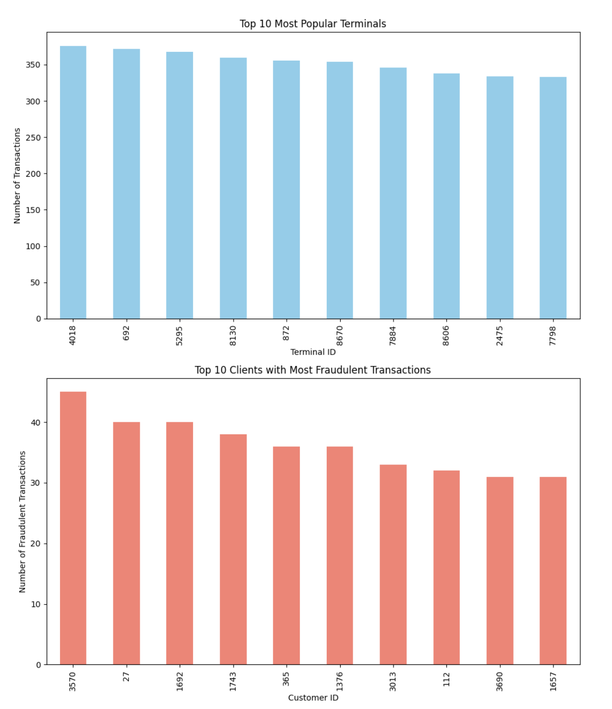

# Chat with your Dataset

This project demonstrates a web-based application to query a dataset through natural language.





For this purpose, it uses:

- [Streamlit](https://streamlit.io/) to build a data science web app
- [Pandasai](https://pandas-ai.com/) to generate Pandas code from a query through [OpenAI GPT-3.5](https://platform.openai.com/docs/api-reference)

## Download dataset

Download the [dataset](https://github.com/Fraud-Detection-Handbook/simulated-data-transformed) into the `data` folder at the root of the project.

## Run the project

Install Python dependencies in the activate Python environment:

```sh
pip install -r requirements.txt
```

Create a [new API key](https://platform.openai.com/account/api-keys) and set it to the `OPENAI_API_KEY` environment variable beforehand.

On Windows:

```bash
set OPENAI_API_KEY="sk-..."
```

On Unix:

```sh
export OPENAI_API_KEY="sk-..."
```

Run the Streamlit project:

```sh
streamlit run main.py
```